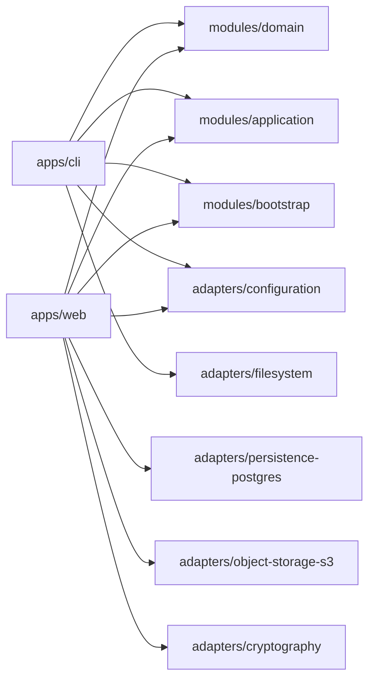
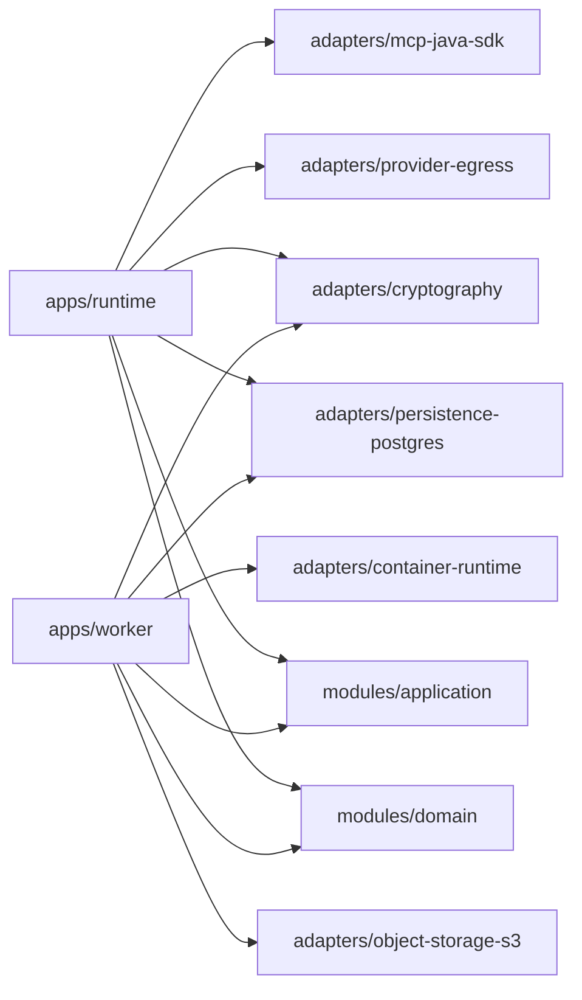
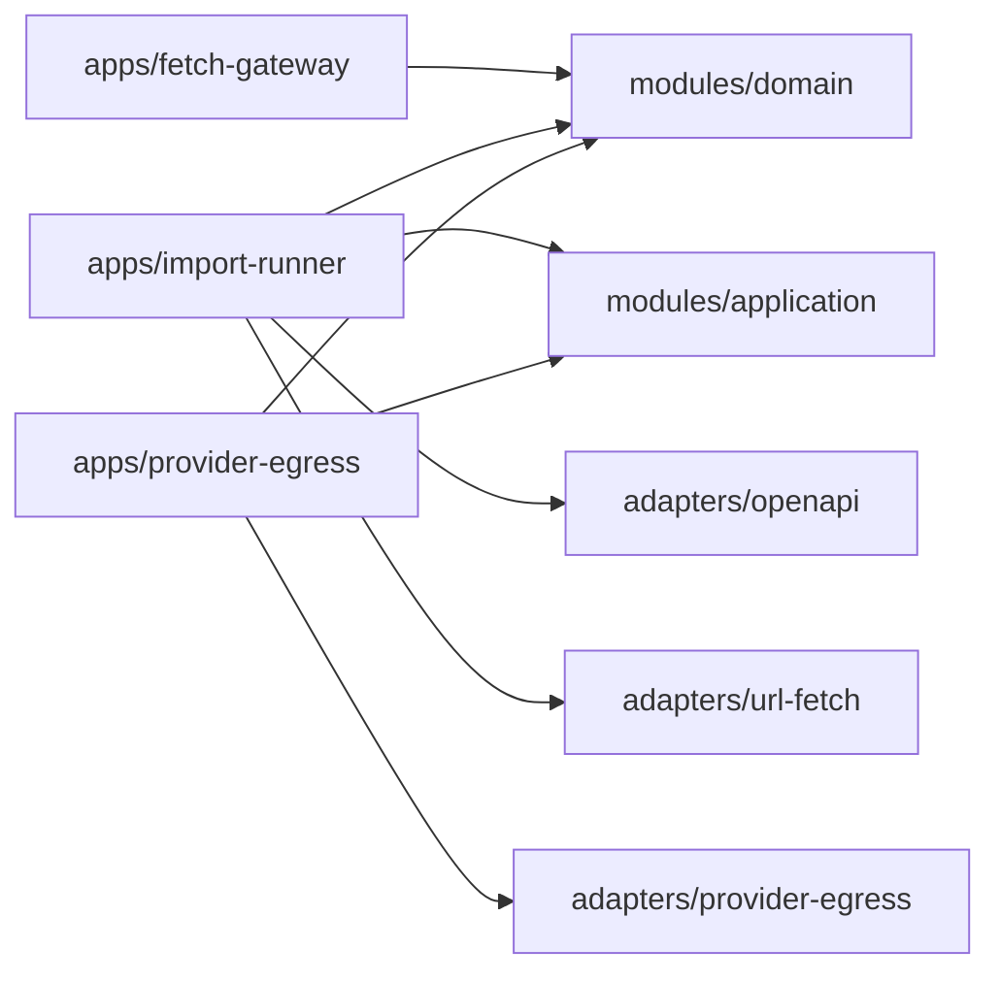
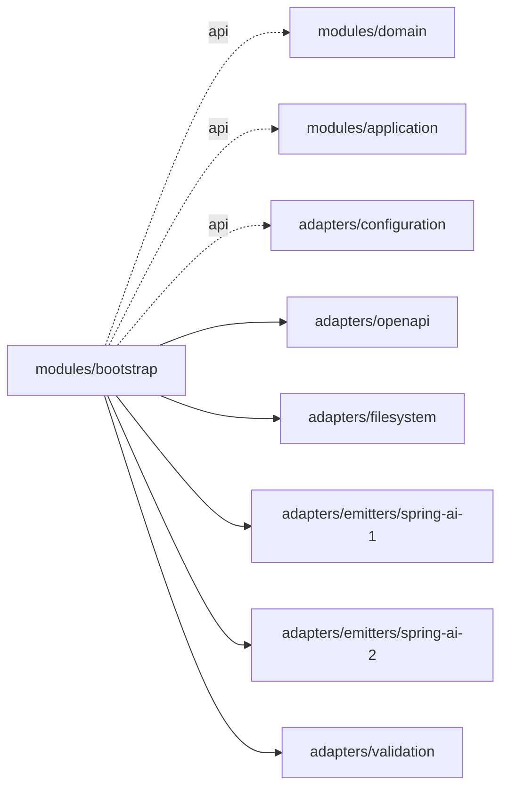
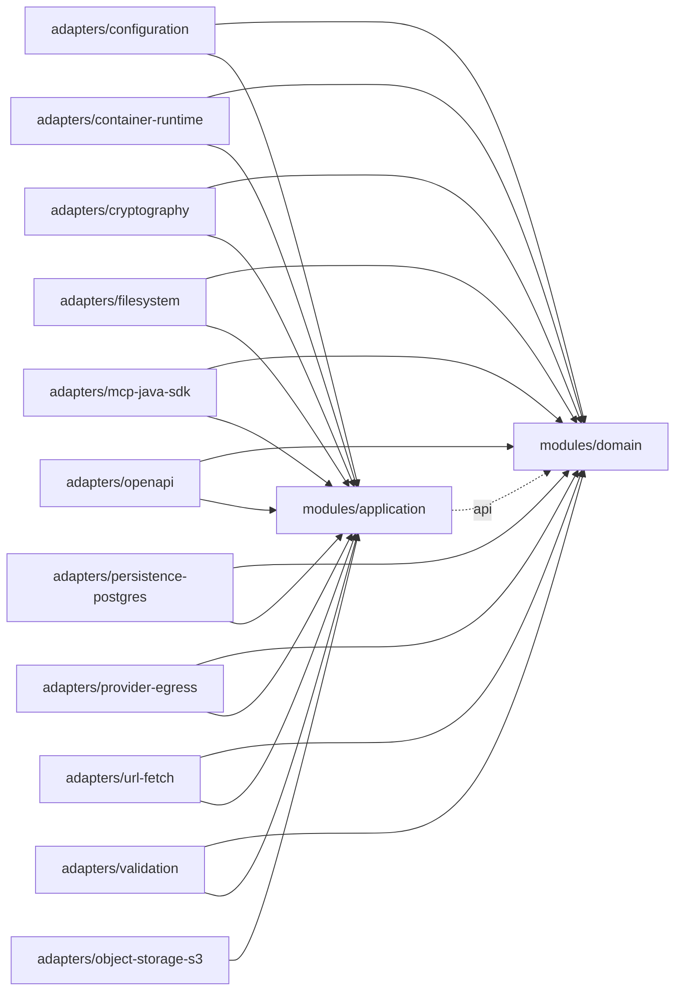
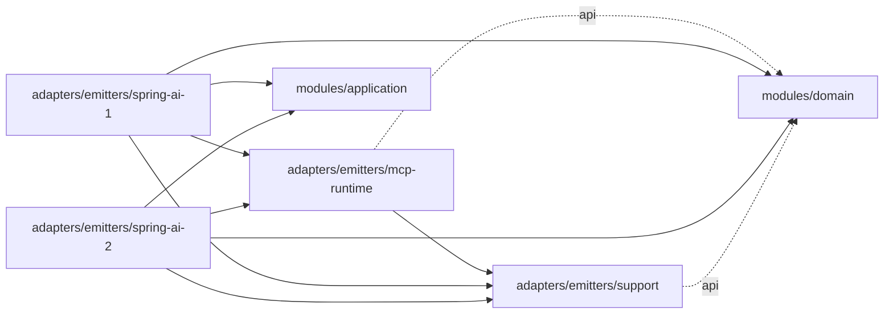

# 모듈 의존성 다이어그램

현재 Gradle production 모듈 **25개와 직접 project 의존 73개**를 나타낸다.
[settings.gradle.kts](../settings.gradle.kts)와 각 모듈의 `build.gradle.kts`가 기준이다.
계층의 책임·금지 방향은 [아키텍처 경계](architecture-boundaries.md), 파일 배치는
[프로젝트 구조](project-structure.md)를 참고한다.

## 읽는 방법

- 화살표는 **사용하는 모듈 → 의존 대상 모듈**이다. HTTP 호출이나 실행 순서를 뜻하지 않는다.
- `api`와 `implementation`은 Gradle 선언 범위다. `api`는 소비 모듈의 컴파일 경로에도 노출된다.
- 실선 화살표(`-->`)는 `implementation`, `api` 라벨이 있는 점선(`-.->`)은 `api`다.
  같은 라벨이 반복되어 선을 가리지 않도록 구분했다. 아래 텍스트 목록에는 모든 범위를 적었다.
- `adapters/…`는 `modules/adapters/…`를 줄인 이름이다. `apps/provider-egress`와
  `adapters/provider-egress`는 별개다.
- 테스트 전용 의존, 외부 라이브러리, 자동으로 따라오는 전이 의존은 그리지 않았다.
  현재 project 의존 선언은 모두 `api` 또는 `implementation`이다.
- 각 그림은 **출발 모듈**을 기준으로 나눴다. 도착 노드는 여러 그림에 반복되지만 직접 의존 화살표는
  전체에서 한 번씩만 나온다. domain은 다른 project에 의존하지 않는다.
- Mermaid를 지원하지 않는 뷰어나 좁은 화면에서는 마지막의 텍스트 목록으로 같은 관계를 확인할 수 있다.

## CLI와 Web

CLI와 Web만 공통 생성기 조립 모듈인 bootstrap을 사용한다. 두 앱도 직접 사용하는 application·domain·adapter를 명시한다.



## Worker와 Managed Runtime

두 앱은 bootstrap 없이 필요한 adapter를 직접 조립한다. Runtime의 provider-egress와 mcp-java-sdk는 공유 adapter 모듈이다.



## Import Runner와 두 gateway

Fetch Gateway는 공유 domain에만 의존한다. gateway 앱과 동명 client adapter는 서로 다른 모듈이며 앱 간 직접 project 의존은 없다.



## 생성기 조립

bootstrap은 생성기 객체 그래프를 조립한다. 공개 결과 타입에 등장하는 domain·application·configuration만 api로 노출한다.



## 일반 adapter와 중심 모듈

application은 domain만 참조한다. 일반 adapter는 application·domain을 향하며, object-storage-s3의 domain 접근은 application의 api를 통한 전이 의존이다. 직접 domain 선언은 없다.



## Emitter의 공유 코드

두 Spring AI 계열은 support와 mcp-runtime을 공유한다. support와 mcp-runtime에서 계열 emitter로 돌아가는 의존이나 계열 간 직접 의존은 없다.



## 모듈별 직접 의존 목록

각 모듈 이름은 실제 빌드 파일로 연결된다. 괄호 안은 선언 범위다.

| 출발 모듈 | 직접 의존 대상 |
| --- | --- |
| [apps/cli](../apps/cli/build.gradle.kts) | `modules/domain` (implementation)<br>`modules/application` (implementation)<br>`modules/bootstrap` (implementation)<br>`adapters/configuration` (implementation)<br>`adapters/filesystem` (implementation) |
| [apps/fetch-gateway](../apps/fetch-gateway/build.gradle.kts) | `modules/domain` (implementation) |
| [apps/import-runner](../apps/import-runner/build.gradle.kts) | `modules/domain` (implementation)<br>`modules/application` (implementation)<br>`adapters/openapi` (implementation)<br>`adapters/url-fetch` (implementation) |
| [apps/provider-egress](../apps/provider-egress/build.gradle.kts) | `modules/domain` (implementation)<br>`modules/application` (implementation)<br>`adapters/provider-egress` (implementation) |
| [apps/runtime](../apps/runtime/build.gradle.kts) | `modules/domain` (implementation)<br>`modules/application` (implementation)<br>`adapters/cryptography` (implementation)<br>`adapters/persistence-postgres` (implementation)<br>`adapters/provider-egress` (implementation)<br>`adapters/mcp-java-sdk` (implementation) |
| [apps/web](../apps/web/build.gradle.kts) | `modules/domain` (implementation)<br>`modules/bootstrap` (implementation)<br>`modules/application` (implementation)<br>`adapters/configuration` (implementation)<br>`adapters/persistence-postgres` (implementation)<br>`adapters/object-storage-s3` (implementation)<br>`adapters/cryptography` (implementation) |
| [apps/worker](../apps/worker/build.gradle.kts) | `modules/domain` (implementation)<br>`modules/application` (implementation)<br>`adapters/persistence-postgres` (implementation)<br>`adapters/object-storage-s3` (implementation)<br>`adapters/cryptography` (implementation)<br>`adapters/container-runtime` (implementation) |
| [adapters/configuration](../modules/adapters/configuration/build.gradle.kts) | `modules/domain` (implementation)<br>`modules/application` (implementation) |
| [adapters/container-runtime](../modules/adapters/container-runtime/build.gradle.kts) | `modules/domain` (implementation)<br>`modules/application` (implementation) |
| [adapters/cryptography](../modules/adapters/cryptography/build.gradle.kts) | `modules/domain` (implementation)<br>`modules/application` (implementation) |
| [adapters/emitters/mcp-runtime](../modules/adapters/emitters/mcp-runtime/build.gradle.kts) | `modules/domain` (api)<br>`adapters/emitters/support` (implementation) |
| [adapters/emitters/spring-ai-1](../modules/adapters/emitters/spring-ai-1/build.gradle.kts) | `modules/domain` (implementation)<br>`modules/application` (implementation)<br>`adapters/emitters/support` (implementation)<br>`adapters/emitters/mcp-runtime` (implementation) |
| [adapters/emitters/spring-ai-2](../modules/adapters/emitters/spring-ai-2/build.gradle.kts) | `modules/domain` (implementation)<br>`modules/application` (implementation)<br>`adapters/emitters/support` (implementation)<br>`adapters/emitters/mcp-runtime` (implementation) |
| [adapters/emitters/support](../modules/adapters/emitters/support/build.gradle.kts) | `modules/domain` (api) |
| [adapters/filesystem](../modules/adapters/filesystem/build.gradle.kts) | `modules/domain` (implementation)<br>`modules/application` (implementation) |
| [adapters/mcp-java-sdk](../modules/adapters/mcp-java-sdk/build.gradle.kts) | `modules/domain` (implementation)<br>`modules/application` (implementation) |
| [adapters/object-storage-s3](../modules/adapters/object-storage-s3/build.gradle.kts) | `modules/application` (implementation) |
| [adapters/openapi](../modules/adapters/openapi/build.gradle.kts) | `modules/domain` (implementation)<br>`modules/application` (implementation) |
| [adapters/persistence-postgres](../modules/adapters/persistence-postgres/build.gradle.kts) | `modules/domain` (implementation)<br>`modules/application` (implementation) |
| [adapters/provider-egress](../modules/adapters/provider-egress/build.gradle.kts) | `modules/domain` (implementation)<br>`modules/application` (implementation) |
| [adapters/url-fetch](../modules/adapters/url-fetch/build.gradle.kts) | `modules/domain` (implementation)<br>`modules/application` (implementation) |
| [adapters/validation](../modules/adapters/validation/build.gradle.kts) | `modules/domain` (implementation)<br>`modules/application` (implementation) |
| [modules/application](../modules/application/build.gradle.kts) | `modules/domain` (api) |
| [modules/bootstrap](../modules/bootstrap/build.gradle.kts) | `modules/domain` (api)<br>`modules/application` (api)<br>`adapters/configuration` (api)<br>`adapters/openapi` (implementation)<br>`adapters/filesystem` (implementation)<br>`adapters/emitters/spring-ai-1` (implementation)<br>`adapters/emitters/spring-ai-2` (implementation)<br>`adapters/validation` (implementation) |
| [modules/domain](../modules/domain/build.gradle.kts) | 없음 |

## 변경 시 확인

`include` 목록이나 production project 의존을 바꾸면 해당 출발 모듈의 그림과 텍스트 목록을 함께 갱신한다.
이 문서는 현재 선언의 스냅샷이며 빌드에서 자동 갱신되지는 않는다.
Gradle의 실제 컴파일·실행 의존을 확인하려면 대상 모듈에 다음 명령을 적용한다.

```bash
./gradlew :apps:runtime:dependencies --configuration compileClasspath
./gradlew :apps:runtime:dependencies --configuration runtimeClasspath
mise run architecture:test
```

의존 보고서는 외부·전이 의존도 출력하므로 그림의 직접 project 의존과 구분해서 읽는다.
아키텍처 검사는 잘못된 모듈 방향, 핵심 계층의 외부 라이브러리, 패키지 순환을 검증한다.
문서와 선언의 일치 여부는 별도로 대조해야 한다.
